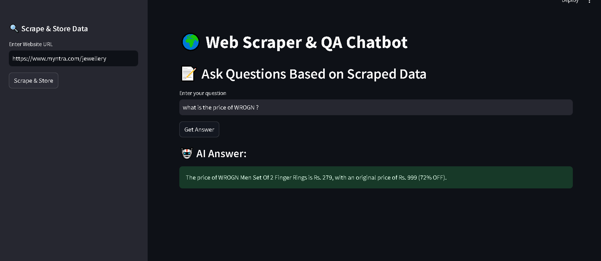

# Web Scraper & AI Q&A Chatbot

[](https://a-webscraper.streamlit.app/)



## Overview
This project is a **Streamlit web app** that allows users to **scrape website content**, store the extracted text in a **FAISS vector database**, and **ask AI-powered questions** based on the scraped data. The app uses **FireCrawl for web scraping**, **Google Gemini for AI responses**, and **FAISS for vector storage**.

## Features
- 🌐 **Web Scraping**: Extracts text from webpages using FireCrawl API.
- 🔍 **Vector Search**: Stores and retrieves information using FAISS.
- 🤖 **AI Q&A**: Answers user queries using Google Gemini-2.0.
- 🎨 **User-Friendly UI**: Built with **Streamlit** for an interactive experience.
- 🔐 **Secure API Key Management**: Uses environment variables to store API keys securely.

## Tech Stack
- **Frontend**: Streamlit
- **Web Scraping**: FireCrawl API
- **Vector Database**: FAISS
- **AI Model**: Google Gemini (via `langchain_google_genai`)
- **Python Libraries**: `streamlit`, `langchain`, `faiss-cpu`, `python-dotenv`

## Setup & Installation
### 1️⃣ Clone the Repository
```bash
git clone https://github.com/YOUR_USERNAME/YOUR_REPO.git
cd YOUR_REPO
```

### 2️⃣ Install Dependencies
```bash
pip install -r requirements.txt
```

### 3️⃣ Set Up API Keys
Create a `.env` file and add your API keys:
```ini
FIRE_CRAWL_API_KEY=your_firecrawl_api_key
GOOGLE_API_KEY=your_google_api_key
```

### 4️⃣ Run the App Locally
```bash
streamlit run app.py
```


### 2️⃣ Deploy on [Streamlit Cloud](https://share.streamlit.io)
- Log in to Streamlit Cloud
- Click **"New App"** and select your GitHub repository
- Set the **branch** to `main` and **Python file** to `app.py`

### 3️⃣ Add Secrets
Go to **"Manage App" → "Secrets"** and add:
```ini
FIRE_CRAWL_API_KEY="your_firecrawl_api_key"
GOOGLE_API_KEY="your_google_api_key"
```

### 4️⃣ Get Your Public URL 🎉
Your app will be deployed and accessible via the provided Streamlit Cloud link!

## Usage
1️⃣ **Enter a website URL** and click **Scrape & Store Data**
2️⃣ **Ask a question** about the scraped content
3️⃣ **Get AI-powered answers** instantly


## License
This project is **open-source** under the MIT License.


